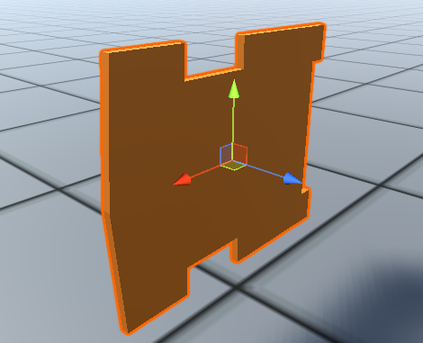
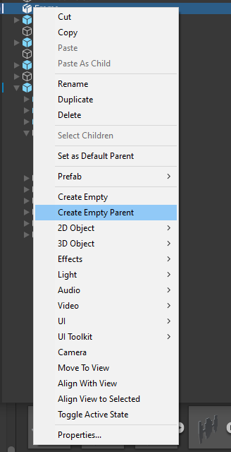
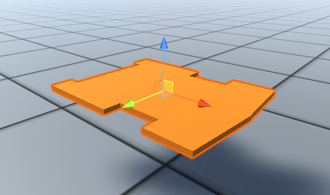
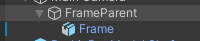
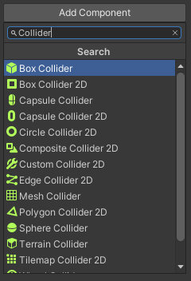
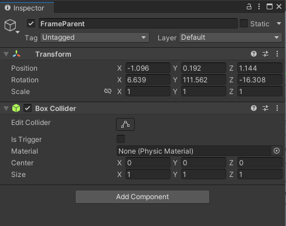
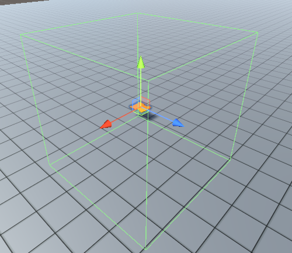
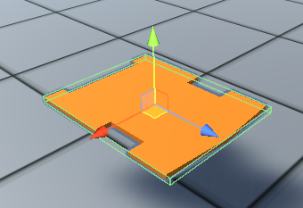
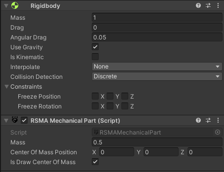
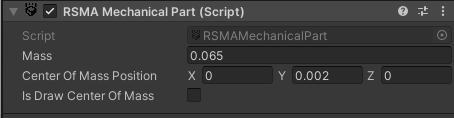

# Setting up the physics of models
[Switch to Russian](../../../Manual/ru/Mechanics/Setting_up_the_physics_of_models.md)

RSMA uses the **RSMAMechanicalPart** module to simulate physical interactions.

## Requirements
- specified direction vectors
- collider component

## Object preparation

### Setting up direction vectors

Working with RSMA and Unity components, it is often necessary to specify the direction of movement, set the axis, and specify the position of a point in space. The Vector3 structure is used for this. 
To simplify working with vectors, it is recommended to adjust the position and rotation of the object. \
\
Importing a 3D model into Unity, the direction vector settings may be incorrect. Because of this, the model may be incorrectly oriented.\
\
It is recommended to create a parent object for the 3D model. To do this, right-click on the object in the Hierarchy window and select Create Empty Parent.\
In the Hierarchy window, select the child object and adjust its rotation and position.\
\
The vectors are set up, the object is ready to work

### Setting up colliders

Colliders define the physical boundaries of the body. If a body does not have a collider, it will not be able to interact with other bodies.\
\
In the Hierarchy window, select the parent object. All further configuration will be done with the parent object.\
\
In the Inspector window, use the "Add Component" button to search for and add the Collider component. \
```You can use any type of 3D collider and even apply multiple colliders if required```\
[Read more about colliders](https://docs.unity3d.com/Manual/CollidersOverview.html)\
\
If the collider is successfully added, it will be displayed in the Inspector window and will appear as a green grid around the object.\
\
Adjust the size and boundaries of the collider.\

## Setting up RSMAMechanicalPart component
\
In the Inspector window, use the "Add Component" button to search for and add the RSMAMechanicalPart component.\
\
If RSMAMechanicalPart has been successfully added, it will be displayed in the inspector window and the Ridigbody component will be automatically added.\
The menu of the RSMAMechanicalPart component has fields:
### Fields

| Field | Description | Type | Values |
|--|--|--|--|
|mass|The mass of body in kilograms|float|from +1,5 x 10e−45 to +3,4 x 10e38|
|centerOfMassPosition|The center of mass relative to the transform's origin position in meters|Vector3|from ±1,5 x 10e−45 to ±3,4 x 10e38|
|isDrawCenterOfMass|If True, the rendering of the position of the center of mass of the body is enabled. The center of mass is displayed as a yellow sphere.|bool|True/False|

\
Use the fields to configure the properties of the object as you need.