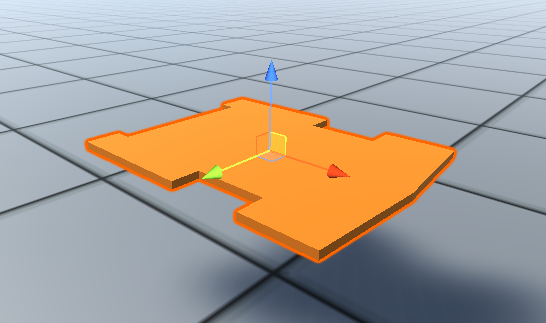
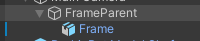
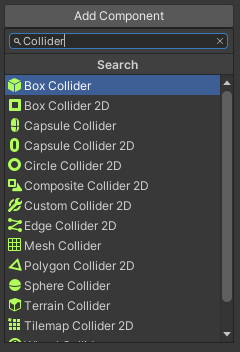
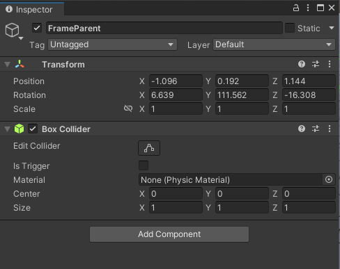
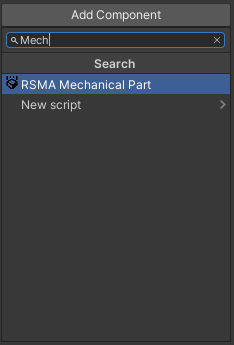
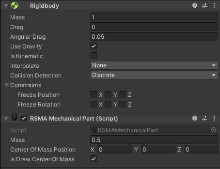

# Настройка физики моделей
[Switch to English](../../../Manual/en/Mechanics/Setting_up_the_physics_of_models.md)

RSMA использует модуль **RSMAMechanicalPart** для моделирования физических взаимодействий.

## Требования
- настроенные векторы направлений
- настроенный компонент Collider 

## Подготовка объекта

### Настройка векторов направлений

При работе с компонентами RSMA и Unity часто возникает необходимость задать направление перемещения, ось вращения и указать положение точки в пространстве. Для этого используется структура Vector3. 
Чтобы упростить работу с векторами, рекомендуется настроить положение и поворот объекта перед началом работы с ним. \
\
При импорте 3D-модели в Unity настройки вектора направлений могут быть некорректными. Из-за этого модель может быть неправильно ориентирована.\
\
Рекомендуется создать родительский объект для 3D-модели. Для этого щелкните правой кнопкой мыши на объекте в окне "Hierarchy" и выберите "Create Empty Parent".\
В окне "Hierarchy" выберите дочерний объект и отрегулируйте его вращение и положение.\
\
Векторы настроены, объект готов к работе

### Настройка коллайдеров

Коллайдеры определяют физические границы тела. Если у тела нет коллайдера, оно не сможет взаимодействовать с другими телами.\
\
В окне "Hierarchy" выберите родительский объект. Вся дальнейшая настройка будет производиться с использованием родительского объекта.\
\
В окне "Inspector"  используйте кнопку "Add Component" для поиска и добавления компонента Collider. \
```Вы можете использовать любой тип 3D-коллайдера и даже использовать несколько коллайдеров, если требуется```\
[Узнайте больше о коллайдерах](https://docs.unity3d.com/Manual/CollidersOverview.html)\
\
Если коллайдер будет успешно добавлен, он отобразится в окне "Inspector" и появится в виде зеленой сетки вокруг объекта.\
\
Отрегулируйте размер и границы коллайдера.\

## Настройка компонента RSMAMechanicalPart
\
В окне "Inspector" используйте кнопку "Add Component" для поиска и добавления компонента RSMAMechanicalPart.\
\
Если RSMAMechanicalPart был успешно добавлен, он отобразится в окне инспектора, и компонент Rigidbody будет добавлен автоматически.\
Меню компонента RSMAMechanicalPart содержит следующие поля:
### Fields

| Поле | Описание | Тип данных | Принимаемые значения |
|--|--|--|--|
|mass|Масса тела в килограммах|float|от +1,5 x 10e−45 до +3,4 x 10e38|
|centerOfMassPosition|Центр масс тела в его локальной системе координат|Vector3|от ±1,5 x 10e−45 до ±3,4 x 10e38|
|isDrawCenterOfMass|Если значение равно True, то включается отображение положения центра масс тела. Центр масс отображается в виде желтой сферы.|bool|True/False|

\
Используйте поля, чтобы настроить свойства объекта так, как вам нужно.